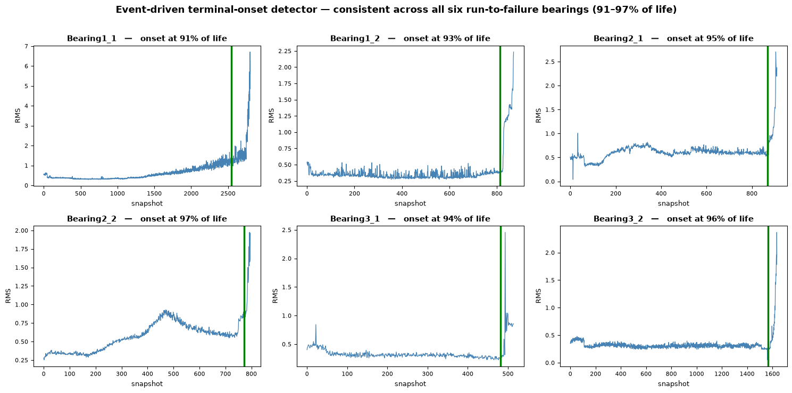

# RUL Estimation on FEMTO-ST Bearings — XGBoost vs. LSTM/GRU

> A Remaining Useful Life (RUL) study on run-to-failure bearings that reaches a
> counter-intuitive conclusion: on this data the **model choice barely matters** —
> the **labelling scheme** is the dominant lever, and the real bottleneck is the
> *observability of the terminal collapse*, not model capacity. The reusable
> contribution is an **event-driven degradation detector** (consistent onset at
> 91–97 % of life), inspired by my first-author IEEE algorithm **IFCR** and
> adapted from repeated-fault to single-collapse data.



*The slope-based detector places the terminal-degradation onset (green line)
consistently near the start of the final collapse on every training bearing —
91–97 % of life, versus 32–99 % for a naïve RMS-threshold detector.*

Remaining Useful Life (RUL) estimation on the FEMTO-ST / PRONOSTIA run-to-failure
bearing dataset (IEEE PHM 2012 Prognostic Challenge). The project compares a
**gradient-boosting baseline (XGBoost)** on engineered condition-monitoring
features against a **recurrent sequence model (LSTM / GRU, PyTorch)** on the same
features, and reports results with regression metrics and the official asymmetric
PHM 2012 score.

The goal of the repository is methodological honesty, not a leaderboard number:
the comparison is designed so that the *only* thing that changes between baseline
and sequence model is whether temporal context is modelled explicitly.

## Headline result (read this first)

On this dataset and setup, the LSTM is **competitive with, but not consistently
better than, the XGBoost baseline** — and its run-to-run variance is of the same
order as the gap between the two models. Test-bearing RMSE (seconds), LSTM shown
as mean ± std over 5 random seeds:

| Test bearing | XGBoost RMSE | LSTM RMSE (mean ± std, n=5) |
|--------------|:------------:|:---------------------------:|
| Bearing1_3   |     540      |         471 ± 137           |
| Bearing2_3   |     686      |         742 ± 56            |
| Bearing3_3   |     689      |         722 ± 65            |

The LSTM edges ahead on Bearing1_3, but its ±137 spread already covers the
XGBoost value, so the advantage is not statistically clean. On the other two
bearings it is marginally behind. With only three test bearings, none of these
differences should be read as a firm ranking — the honest conclusion is that
explicit temporal modelling does **not** buy a robust improvement here, and the
dominant factor turns out to be the **RUL labelling scheme**, not the model.

Qualitatively the two models fail differently, and that matters more than the
aggregate numbers: XGBoost, seeing each snapshot in isolation, produces noisy,
non-monotonic predictions; the LSTM produces a smooth trajectory but tends to
under-predict during the long healthy plateau. Aggregate RMSE is dominated by
that long plateau, so it rewards whichever model fits the "easy" constant region
— which is not necessarily the model that is more useful near failure.

That observation is what motivates the **two-stage, event-driven system** below,
where an event detector anchors the RUL countdown. It yields a real metric
improvement for the LSTM — but, as the section explains honestly, the deeper
finding is a *data* limit: the terminal collapse is too fast and sample-poor for
any model to track precisely.

## Why this is set up the way it is

- **Shared features for both models.** Time- and frequency-domain health
  indicators (RMS, kurtosis, crest factor, spectral band energies, …) are
  extracted once per snapshot and fed to *both* XGBoost and the RNN. This
  isolates the effect of temporal modelling from the effect of a richer input.
- **RUL labelling is the hard part, and it drives the results.** A naïve linear
  RUL (`total_life − t`) asserts the bearing is dying from t=0, which is
  physically false. Several schemes are implemented and compared: `linear`,
  `capped` (`min(linear_rul, C)` with a fixed constant `C`), and
  `piecewise_slope` (plateau until a *detected* terminal-onset, then a ramp).
  An early RMS-threshold onset detector proved fragile — First Prediction Time
  ranged from 32% to 99% of life — so on the **full trajectory** the reported
  numbers use `capped` (`C = 2500 s`), consistent across bearings. Ablating `C`
  (5000 → 2500) changed which model "wins", confirming labelling is the dominant
  lever. The robust slope-based detector and the event-driven `piecewise_slope`
  scheme are where this project's main contribution lives (see the two-stage
  section below).
- **No data leakage.** Train/test split is **by bearing**, never by random
  snapshot. Feature scalers are fit on training bearings only, per operating
  condition. Early stopping uses a held-out *training* bearing, not the test set.
- **Asymmetric evaluation.** Alongside RMSE/MAE, the PHM 2012 score penalises
  late (over-optimistic) predictions harder than early ones.

## Relation to prior work (IFCR)

The weak point above — turning fault events into a sound supervised RUL target —
is exactly the problem addressed by **Inverted Fault Count Regression (IFCR)**,
the labelling algorithm introduced in my first-author paper (see references).
IFCR builds the RUL target from **explicit, repeating fault counters**: it counts
recordings since the last fault, resets on each fault, and inverts the interval
to get a remaining-life column — well suited to assets that fail repeatedly (e.g.
a water pump with several failures over its monitoring period).

FEMTO-ST is a *different* regime: each bearing is **run-to-failure** (a single
terminal event, no repeating counter), so IFCR does not transfer directly. That
mismatch is precisely what motivates the onset-detection step here — locating a
per-bearing degradation onset is the run-to-failure analogue of IFCR's
fault-counter reset. This project implements that idea as a slope-based
terminal-onset detector and a two-stage system built on it (see next section),
turning IFCR's event-driven principle into something usable on single-collapse
data.

**Why the two regimes are complementary.** IFCR treats the countdowns between
repeated faults as comparable. In practice they are not: after a repair, each new
interval starts from a *degraded* state, so cumulative wear drifts across
successive fault cycles (the interval after the 6th fault is not equivalent to the
one after the 1st). A repeated-fault dataset therefore entangles two effects —
degradation *within* an interval and drift *across* intervals. FEMTO's bearings
remove the second effect entirely: they are independent, identically distributed
realisations of the same process, each starting from a clean healthy state, so the
degradation phenomenon is isolated from cross-cycle drift. This makes FEMTO a
cleaner, more controlled setting — but also a less realistic one: real industrial
assets *are* repaired and *do* age, so the repeated-fault case is closer to
deployment reality. The two are complementary rather than one being better: FEMTO
isolates the phenomenon, the repeated-fault case captures operational complexity.

## Event-driven labelling and the two-stage system

The main technical contribution builds directly on the IFCR idea above. Rather
than labelling RUL as a countdown over the whole life, an **event** anchors it —
here, the onset of the *terminal* acceleration of degradation.

**The detector.** `detect_fpt_slope` works on the slope of the smoothed RMS, not
on RMS itself, so it ignores a slow monotonic drift (near-zero slope) and fires
only where degradation accelerates. A start-up transient (the bearing settling to
thermal/load regime in the first samples) is discarded before estimating a robust
(median + MAD) baseline, otherwise it inflates the threshold and gets latched as a
false onset. Across the six training bearings the detected onset is tight and
consistent — **91–97 % of life** — versus 32–99 % for the earlier RMS-threshold
detector. It also generalises to test bearings with a clear terminal collapse
(Bearing1_3 → 70 %, Bearing3_3 → 92 %); it does **not** fire sensibly on
Bearing2_3 (21 %), whose trajectory has an early spike and then a flat tail with
no clear terminal collapse — a documented failure mode, not a tuning issue.

**The two-stage idea.** In real predictive maintenance you don't need a precise
RUL countdown while the asset is healthy; you need it once degradation is
detected. So: the detector raises the alarm, and only then is the RUL regression
trusted. Evaluated in that **post-alarm regime** (leave-one-bearing-out over the
six run-to-failure training bearings, life-normalised RMSE, lower is better):

| Labelling         | XGBoost | LSTM  |
|-------------------|:-------:|:-----:|
| `capped`          |  0.075  | 0.181 |
| `piecewise_slope` |  0.074  | **0.119** |

Event-driven labelling improves the LSTM's post-alarm nRMSE by ~34 % on average
and removes its worst case (one held-out bearing went from 0.474 under `capped`
to 0.197).

**An honest caveat, found by looking at the curves rather than the numbers.**
Inspecting the actual post-alarm predictions shows that *neither* model tracks the
terminal ramp: both predict a roughly constant low value while true RUL falls to
zero. The `piecewise_slope` advantage in nRMSE is therefore real but comes from a
more favourable target *scale* in the post-alarm window, **not** from the model
learning to follow the collapse. In other words, the metric improves without the
underlying behaviour improving — a distinction that only the plots reveal.

The reason is a property of the data, not of the model or the labelling: in these
accelerated run-to-failure tests the terminal collapse is extremely fast and
represented by very few samples, so there is not enough signal for *any* model to
regress the final countdown precisely. The bottleneck is the **observability of
the collapse**, not model capacity. This is the project's central, honest finding
— and it is exactly the kind of limit no amount of architecture or tuning can fix.

The detector itself remains a solid, reusable result, and the two-stage framing is
the run-to-failure realisation of IFCR's principle: an explicit event triggers the
countdown, exactly as the fault counter does in the repeated-fault setting.

## Project structure

```
femto-rul/
├── src/
│   ├── config.py         # paths, acquisition constants, condition map
│   ├── data_loading.py   # robust reading of acc_*.csv snapshots
│   ├── features.py       # time/frequency-domain feature extraction
│   ├── labeling.py       # RUL targets + slope-based terminal-onset detector
│   ├── dataset.py        # PyTorch sliding-window sequence builder
│   ├── models.py         # LSTM/GRU RUL regressor
│   ├── train.py          # training loop (early stopping, grad clipping)
│   ├── evaluate.py       # RMSE, MAE, PHM 2012 score
│   └── pipeline.py       # leakage-safe scaling
├── scripts/
│   ├── run_xgboost_baseline.py
│   └── run_lstm.py
├── notebooks/
│   └── 01_methodology.ipynb   # exploration, labelling, model comparison
└── data/                       # FEMTO-ST goes here (gitignored)
```

## Setup

```bash
python -m venv .venv && source .venv/bin/activate   # Windows: .venv\Scripts\Activate.ps1
pip install -r requirements.txt
```

Two practical notes learned the hard way:

- **Use Python 3.12 (or 3.13) if you want GPU.** On Windows, PyTorch currently
  ships **CPU-only** wheels for Python 3.14; installing the CUDA build requires
  3.12/3.13. Install PyTorch first with the CUDA index from pytorch.org, then
  `pip install -r requirements.txt`.
- **Data folder names.** Place the dataset so that
  `data/Learning_set/Bearing1_1/acc_00001.csv` exists. Some redistributions name
  the folders differently (e.g. `Training_set`); the scripts expect
  `Learning_set` for training and `Test_set` for test (`--data-set` / `--test-set`
  to override). Verify the CSV layout too — see the note in `src/data_loading.py`.

## Running

```bash
# baseline first — it anchors the comparison
python -m scripts.run_xgboost_baseline --label-mode capped \
    --train Bearing1_1 Bearing1_2 Bearing2_1 Bearing2_2 Bearing3_1 Bearing3_2 \
    --test  Bearing1_3 Bearing2_3 Bearing3_3

# sequence model
python -m scripts.run_lstm --rnn lstm --window 30 --label-mode capped \
    --train Bearing1_1 Bearing1_2 Bearing2_1 Bearing2_2 Bearing3_1 Bearing3_2 \
    --test  Bearing1_3 Bearing2_3 Bearing3_3
```

## Scope and limitations (read before drawing conclusions)

- **Three test bearings is very few.** The differences above are within run-to-run
  variance; treat this as a demonstration of a sound, leakage-free pipeline, not
  a benchmark claim.
- The LSTM shows high seed-to-seed variance (hence the ±std reporting), a direct
  consequence of training on only five bearings.
- Both models struggle in the final, fast collapse to zero RUL, where labelled
  examples at low RUL are scarce — a data-imbalance issue, not an architecture one.
- The slope-based onset detector assumes an **identifiable terminal collapse**.
  It generalises well to bearings that have one, but fails on atypical
  morphologies (e.g. Bearing2_3: early spike, flat tail, no clear collapse). With
  a single such example there is not enough data to generalise a fix — it is
  reported as a known limitation rather than tuned away.
- The two-stage result is validated by leave-one-bearing-out over the six
  run-to-failure bearings (where the detector is reliable); the three official
  test bearings are used only for the full-trajectory comparison.

## References

- P. Nectoux et al., *PRONOSTIA: An experimental platform for bearings
  accelerated degradation tests*, IEEE PHM 2012.
- IEEE PHM 2012 Prognostic Challenge scoring definition.
- Y. Amorelli, F. Termine, G. Pau, F. Arena, V. M. Salerno, M. Collotta,
  *Predictive Maintenance for Water Supply Networks: Advanced Expert System
  Models for Enhanced Water Resource Management and Monitoring*, IEEE MetroLivEnv
  2025. (Introduces the Inverted Fault Count Regression — IFCR — labelling
  algorithm.)
